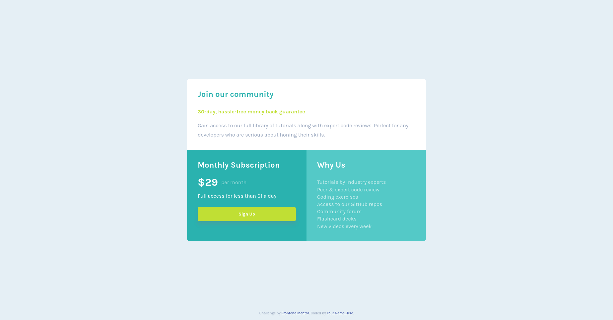

# Frontend Mentor - Single price grid component solution

This is a solution to the [Single price grid component challenge on Frontend Mentor](https://www.frontendmentor.io/challenges/single-price-grid-component-5ce41129d0ff452fec5abbbc). Frontend Mentor challenges help you improve your coding skills by building realistic projects. 

## Table of contents

- [Overview](#overview)
  - [The challenge](#the-challenge)
  - [Screenshot](#screenshot)
  - [Links](#links)
- [My process](#my-process)
  - [Built with](#built-with)
  - [What I learned](#what-i-learned)
- [Author](#author)

## Overview

### The challenge

Users should be able to:

- View the optimal layout for the site depending on their device's screen size

### Screenshot

Here are the screenshots of my solution:
1. Desktop View

2. Mobile View

### Links

[Live Site URL](https://fborlido.github.io/single-price-grid-component/)

## My process

### Built with

- Semantic HTML5 markup
- Sass
- Flexbox
- CSS Grid
- Mobile-first workflow

### What I learned

I used this challenge to get my hands on CSS Grid and how it works. It's a great template for that purpose!
This was also my first time using @media_queries.

To see how you can add code snippets, see below:

## Author

Frederico Borlido, from Portugal!

- Frontend Mentor - [@fborlido](https://www.frontendmentor.io/profile/fborlido)
- GitHub - [@fborlido](https://github.com/fborlido)
